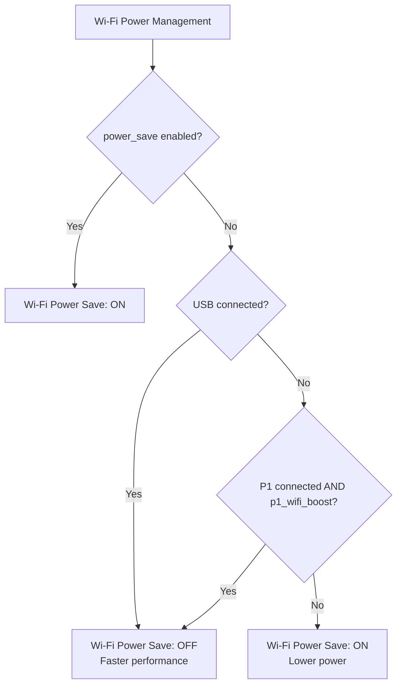
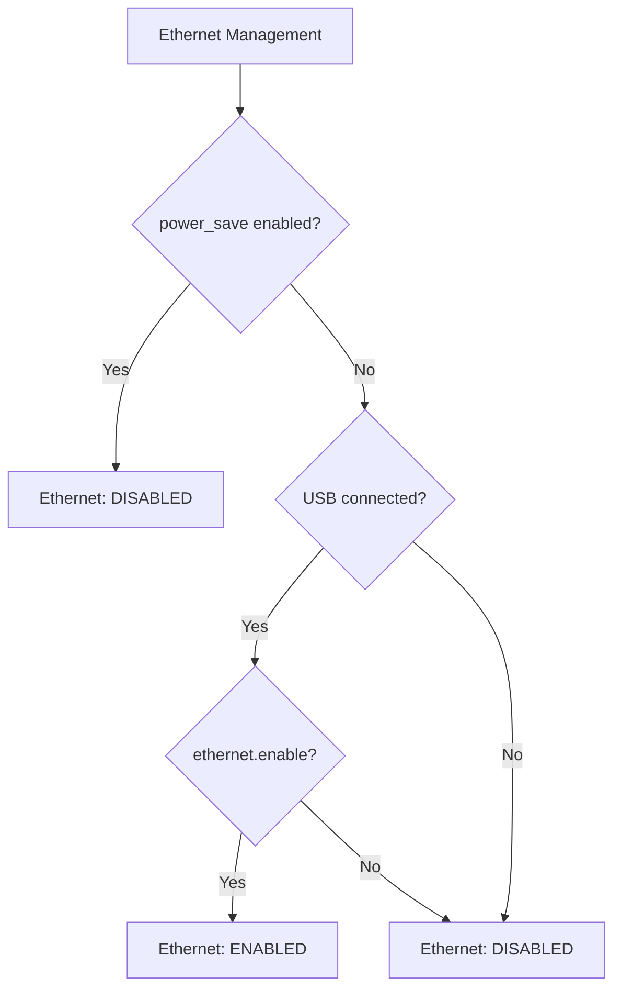

# Device Settings

## Document Context

- **Purpose**: Configure device system settings, service enablement, and authentication protection
- **When to use**: For initial device setup, service configuration, security setup, or system administration
- **Prerequisites**: Network access to device; understanding of intended services and security requirements
- **Related to**: Device initialization, service management, Web UI protection, cloud integrations
- **Validates against**: Real device settings from whatwatt Go hardware

## Key Facts

- **Endpoint**: `/api/v1/settings`
- **Methods**: GET, POST, PUT
- **Authentication**: Required when device Web UI password is set
- **Dynamic apply**: Changes take effect immediately without reboot
- **Response format**: JSON with nested system and services objects
- **Sections**: `system` (device identity, protection) and `services` (cloud/local integrations)
- **No reboot needed**: Configuration changes apply dynamically
- **Error codes**: 400 (invalid config), 401 (auth required)

## Endpoint Details

This endpoint manages the device's basic system settings and enables/disables built-in services.

| Endpoint              | `api/v1/settings` |
| --------------------- | ----------------- |
| Method                | GET, POST, PUT    |
| Response content type | application/json  |

!!! info "Dynamic apply"
    Configuration changes are applied without requiring a device reboot. The Web UI and HTTP pages reload dynamically after updates. Avoid reboots during operation; only firmware upgrades trigger an automatic restart.

## Object schema

- Top-level sections
  - `system`: device-identifying properties and access protection
  - `services`: cloud/local integrations and built-in services

### Fields: system

| JSON path              | Type    | Default                 | Range/Rules                             | Notes |
| ---------------------- | ------- | ----------------------- | --------------------------------------- | ----- |
| `system.name`          | string  | ""                      | length 0..31                            | Friendly device name |
| `system.host_name`     | string  | `whatwatt_XXXXXX`       | length 0..31; must be a valid hostname  | Used on network and for realm; write rejected if invalid |
| `system.protection`    | boolean | false                   |                                         | When true and `password` set, HTTP auth is enforced |
| `system.password`      | string  | ""                      | length 0..31                            | Write-only; hidden in GET responses |
| `system.power_save`    | boolean | false                   |                                         | Global power save mode; see constraint below |
| `system.p1_wifi_boost` | boolean | true                  |                                         | When true and P1 is connected, disables Wi‑Fi power save to boost throughput |

Constraints

- Enabling `system.power_save` is rejected while the Ethernet link is UP (request returns 400).
- `system.host_name` must be valid; invalid value causes 400.

### Power Management Decision Trees

The device implements intelligent power management based on connection type and configuration settings.

#### Wi-Fi Power Save Logic



#### Ethernet Enable Logic



**Key Points:**

- **Global power_save**: Overrides all other settings (Wi-Fi power save ON, Ethernet OFF)
- **p1_wifi_boost**: When enabled and P1 is connected, Wi‑Fi power save is disabled (higher throughput)
- **USB connection**: Indicates external power, enabling faster performance
- **P1 connection**: With boost enabled, active P1 link disables Wi‑Fi power save
- **Ethernet**: Enabled when USB power is present AND `ethernet.enable` is set; disabled when `power_save` is true

### Fields: services

| JSON path                                 | Type     | Default             | Range/Rules                     | Notes |
| ----------------------------------------- | -------- | ------------------- | ------------------------------- | ----- |
| `services.cloud.what_watt`                | boolean  | true                |                                 | whatwatt Cloud integration |
| `services.cloud.solar_manager`            | boolean  | false               |                                 | Solar Manager cloud |
| `services.cloud.mystrom`                  | boolean  | true                |                                 | myStrom cloud |
| `services.cloud.stromkonto`               | boolean  | false               |                                 | Stromkonto cloud |
| `services.local.solar_manager`            | boolean  | false               |                                 | Local Solar Manager API |
| `services.broadcast`                      | boolean  | true                |                                 | mDNS broadcast (discovery) |
| `services.other_energy_provider`          | boolean  | false               |                                 | Enable other energy provider features |
| `services.report_interval`                | uint     | 30                  | 1..3600 (seconds)               | Cloud/custom reporting interval |
| `services.log`                            | boolean  | false               |                                 | Enable internal log service |
| `services.meter_proxy`                    | boolean  | false               |                                 | Enable meter proxy service |
| `services.sd.enable`                      | boolean  | false               |                                 | Store periodic reports to SD card |
| `services.sd.frequency`                   | uint     | 15                  | 1..1440 (seconds)               | SD write cadence |
| `services.sd.recorder_mode`               | boolean  | false               |                                 | Standalone SD recorder mode (FW 2.0.1+) |
| `services.modbus.enable`                  | boolean  | false               |                                 | Modbus TCP server |
| `services.modbus.port`                    | uint     | 502                 | 1..65535                        | Modbus TCP port |
| `services.berry.auto_run`                 | boolean  | false               |                                 | Auto-run Berry script on boot |
| `services.berry.run_delay`                | uint     | 300                 | 60..86400 (seconds)             | Delay before auto-run |

## Examples

### Read current settings

=== "No auth"
    ```bash
    curl http://whatwatt-XXXXXX.local/api/v1/settings
    ```

=== "With password"
    ```bash
    curl --anyauth -u :PASSWORD http://whatwatt-XXXXXX.local/api/v1/settings
    ```

Example response (abridged):

```json
{
  "system": {
    "name": "",
    "host_name": "whatwatt_9F8124",
    "protection": false,
    "power_save": false,
    "p1_wifi_boost": true
  },
  "services": {
    "cloud": {
      "what_watt": true,
      "solar_manager": false,
      "mystrom": false,
      "stromkonto": false
    },
    "local": {
      "solar_manager": false
    },
    "broadcast": true,
    "other_energy_provider": false,
    "report_interval": 30,
    "log": false,
    "meter_proxy": false,
    "sd": { "enable": false, "frequency": 15 },
    "modbus": { "enable": false, "port": 502 },
    "berry": { "auto_run": false, "run_delay": 300 }
  }
}
```

### Enable Web UI protection

```json
{
  "system": {
    "protection": true,
    "password": "your-secure-password"
  }
}
```

### Configure SD card reports logging

```json
{
  "services": {
    "sd": { "enable": true, "frequency": 60 }
  }
}
```

### Enable Modbus TCP

```json
{
  "services": {
    "modbus": { "enable": true, "port": 502 }
  }
}
```

## Method semantics

- GET: returns current settings (with `system.password` hidden)
- PUT: partial update; only provided fields change
- POST: full replace; unspecified fields reset to zero/empty/false

!!! note "Recommendations"
    - Prefer PUT for targeted changes
    - For POST, include the complete desired object to avoid resetting fields unintentionally

## Error cases

- 400 Bad Request
  - Invalid `system.host_name`
  - Attempt to enable `system.power_save` while Ethernet link is active
  - Payload fails validation (types/ranges)

## See also

- [REST conventions](rest-conventions.md)
- [System Info (read-only)](../10-general/system-info.md)
